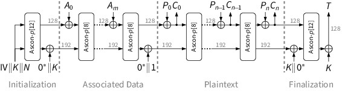
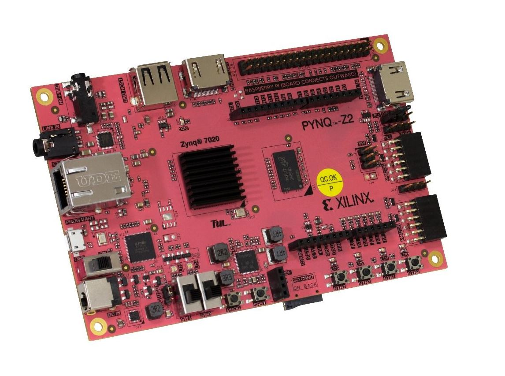

# Note d'application - Projet FPGA sécurisé

## Contexte

Dans de nombreux cas d'application, la transmission de données est nécéssaire. La sécurisation de ces données est donc requise afin de les protéger et de respecter les utilisateurs. Ce projet à pour but de mettre en oeuvre un algorithme de chiffrement **ASCON-128** pour sécuriser l'échange de données d'électrocardiogrammes entre capteur (électrodes) et système de traitement (ici l'ordinateur de l'utilisateur).
Le dépot de ce projet contient deux sous répertoires:
* "*FPGA_ASCON128*"
* "*PC_UI*"

### Répertoire "*FPGA_ASCON128*"
Afin de garantir une vitesse acceptable de chiffrement, cet algorithme à été implémenté matériellement dans un FPGA. Le sous dossier "*FPGA_ASCON128*" contient les sources *SystemVerilog* de cette description.

### Répertoir "*PC_UI*"
Pour simplifier la communication avec le FPGA, une librairie de fonctions à été implémentée (fichier python *FPGA.py*). Une interface d'affichage et d'analyse de ces données à également été implémentée en utilisant la librairie de fonctions *FPGA.py*.


## Module de chiffrement

L'algorithme de chiffrement ASCON128 à été développé pour permettre un chiffrement sécurisé et authentifié sur des cibles embarquées. Il peut être implémenté matériellement (ce qui est le cas ici) ou en logiciel.

Ce projet s'appuie sur la description suivante (partie chiffrement):

<p align=center>
    
</p>

Le fonctionnement de l'algorithme est décrit sur le site suivant:
https://ascon.isec.tugraz.at/specification.html


## Classe python d'interface avec le module de chiffrement sur FPGA

La classe d'interface avec le module de chiffrement sur FPGA se trouve dans le fichier python *FPGA.py*. Elle contient les fonctions suivantes:

```python
- def __init__(self, port, baudrate)
- def open_instrument(self)
- def send_key(self, key)
- def send_nonce(self, nonce)
- def send_associated_data(self, associated_data)
- def send_waveform(self, wave)
- def start_encryption(self)
- def get_cipher(self)
- def get_tag(self)
- def close_instrument(self)

- def read_csv_file(self, filename)
- def encrypt_waveform_python(self, wave, key, nonce, associated_data)
- def decrypt_waveform_python(self, wave, key, nonce, associated_data)
- def list_from_wave(self, wave)
```

Chacune des fonctions de communication avec le FPGA affiche dans le terminal les erreurs rencontrées et les copies dans un fichier de log "*log.txt*". Les entrées et sorties des fonctions sont décrite dans le fichier source.


## Guide de démarrage rapide - exemple d'utilisation

Pour notre exemple d'utilisation, nous mettrons en place ce circuit de données:
- Récupération d'électrocardiogrammes depuis un fichier base de données
- Envoi des ECGs un par un au FPGA pour chiffrement via le port UART
- Récupération des chiffrés par le port uart
- Déchiffrement sur l'ordinateur des chiffrés
- Affichage dans une interface utilisateur des ECGs et analyses élémentaires des traces

Le matériel utilisé est le suivant:

<p align=center><br><b>Carte XILINX pynqZ2</b></p>

Afin de mettre en place ce système, les étapes suivantes doivent être suivies:

1. Téléchargez le bitstream pour le FPGA dans le répertoire "*FPGA_ASCON128*" et programmez le FPGA avec en utilisant le logiciel *Vivado*.
2. Branchez un **module UART** sur la partie haute du PMOD A de la carte *pynqZ2* puis connectez avec un câble micro USB la carte et l'ordinateur. Il faut toujours conserver la carte alimentée pour ne pas supprimer sa programmation.
3. Executez le programme "*main.py*" du répertoire "*PC_UI*" pour avoir l'interface utilisateur. En cas de bon fonctionnement vous devriez avoir les ECG s'affichant dynamiquement sur l'interface avec également des informations d'analyses sur chaque.
